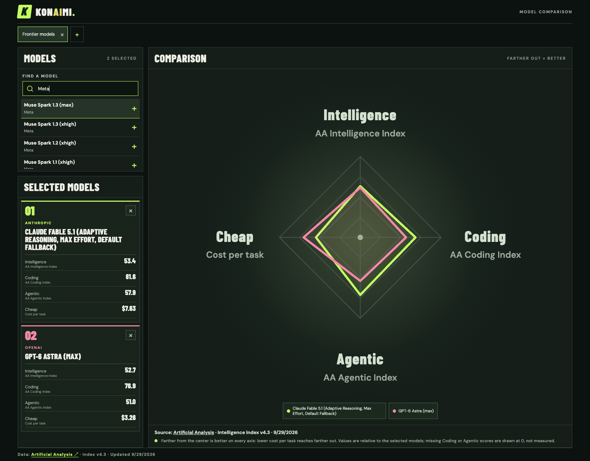
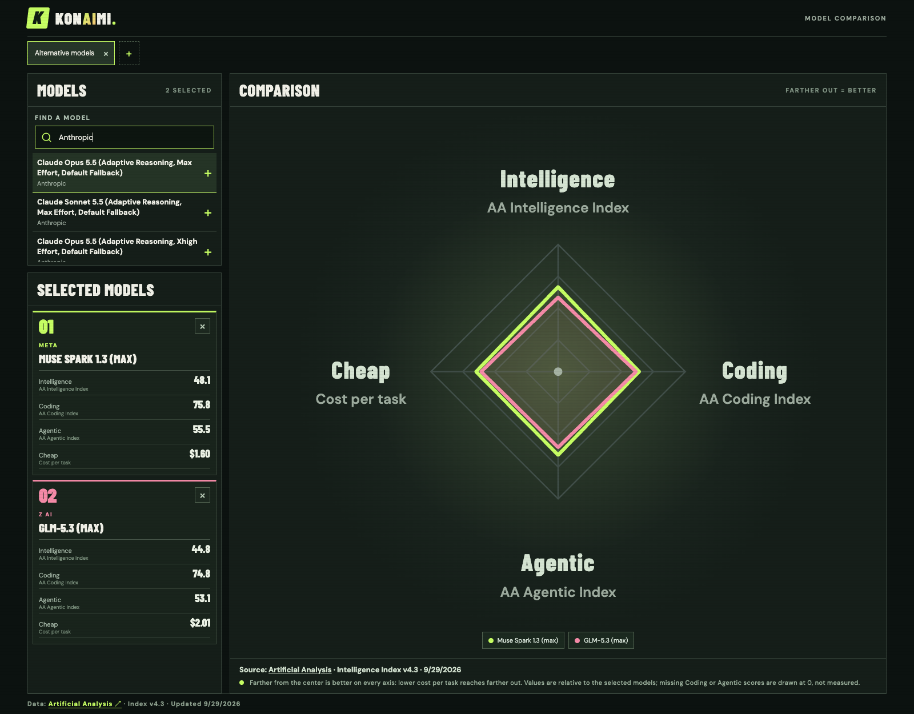

# Konaimi

A private, PES-inspired comparison of AI models. The MVP shows Artificial Analysis's Intelligence, Coding, and Agentic indices plus **cost per Intelligence Index task**. Thinking levels appear separately when the API lists them. Select as many models as you like; the full-width chart is relative to the selection, and its legend can highlight one model at a time. Exact numbers remain visible in the cards.

## Screenshots

These are snapshots of live [Artificial Analysis](https://artificialanalysis.ai/) data (Intelligence Index v4.3, September 29, 2026). Each selected model has values for all four displayed stats; current scores may differ. Confirm the provider's chart-sharing and attribution requirements before publishing this README.

**Claude Fable 5.1 (Adaptive Reasoning, Max Effort, Default Fallback) and GPT-6 Astra (max)**



**Muse Spark 1.3 (max) and GLM-5.3 (max)**



## Start

```sh
npm install
cp .env.example .env.local
npm run dev
```

Visit `http://localhost:3000`. Without an API key, the app uses **clearly marked fictional demo data** so you can try the interface. To use live scores, create an Artificial Analysis key and set `ARTIFICIAL_ANALYSIS_API_KEY` in `.env.local`, then restart the server. Never put the key in client-side code.

`npm test`, `npm run lint`, and `npm run build` check the project.

With the app running and `agent-browser` installed, run `npm run screenshots -- http://127.0.0.1:3000` to refresh the screenshots and their captions from current live data.

## Data and access

The server requests all pages of the [Artificial Analysis Free language-model API](https://artificialanalysis.ai/data-api/docs#getLanguageModelsFree), refreshes cached data about every six hours, and keeps the last complete in-process snapshot if a later refresh fails. Named comparison tabs and their model IDs are stored in your browser, separately for demo and live data. Double-click a tab name to rename it. No sign-in or database is used.

Artificial Analysis requires attribution and limits Free API use to **internal use**. Keep this app on your own computer or behind access control; do not deploy it as an open public site under a Free key. Confirm permissions before sharing it with others. The four-point chart does **not** include speed: the API does not expose the site's Time per Intelligence Index Task value, and output tokens per second is not a substitute. Once a permitted task-time source is available, it can become a fifth point.
