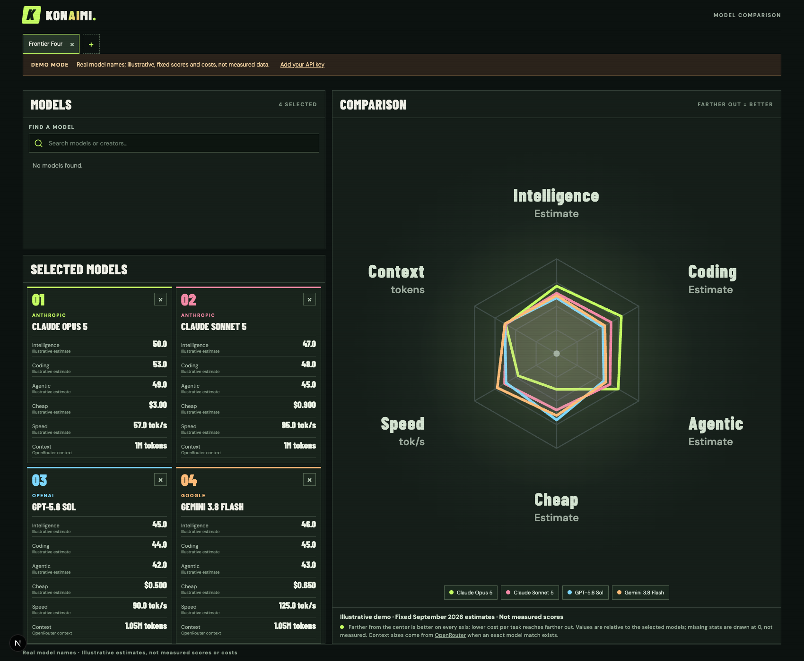

# Konaimi

A public model comparison app. The page starts with three selected models and a fourth available to add: Claude Opus 5, GPT-6 Astra, Claude Fable 5, and GPT-5.6 Sol have fixed, illustrative scores, cost, and output speed. These estimates are not benchmark measurements or Artificial Analysis data. Context window sizes come from OpenRouter's public model catalog. To compare measured models, each visitor enters their own Artificial Analysis API key when they try to add a model. The key stays in that browser's local storage and is sent to Konaimi's server only to request data from Artificial Analysis. The server does not save the key or cache the response across visitors.

The six chart axes are Intelligence, Coding, Agentic, Cheap (inverse cost per task), Speed (median output tokens per second), and Context (window size in tokens). Live speed comes from the Artificial Analysis Free API. That API excludes context window size, so the server joins it from [OpenRouter](https://openrouter.ai/models) only when the model name and creator match exactly; unmatched context values remain missing, not guessed. Output speed is not time to complete a task.

Artificial Analysis requires attribution and restricts Free API use to internal use. Only use your own key and data in line with your agreement. Do not publish or share live results without permission.

## Screenshot



This demo image compares Claude Opus 5, Claude Sonnet 5, GPT-5.6 Sol, and Gemini 3.8 Flash. Scores, costs, and speeds are **illustrative estimates**, not benchmark results. Context sizes are from [OpenRouter](https://openrouter.ai/models). To refresh it, start the app locally and run `npm run screenshots -- http://127.0.0.1:3000`.

## Start

```sh
npm install
npm run dev
```

Visit `http://localhost:3000`. Click a demo model or **Add your API key** to enter a key. The server never uses an environment key. Named comparisons and model selections are kept in browser local storage; **Forget key** removes the saved key and returns to demo mode. Do not enter a key on a shared device.

Run `npm test`, `npm run lint`, and `npm run build` to check the project.

## Deployment

The `main` branch of [pablopunk/konaimi](https://github.com/pablopunk/konaimi) automatically deploys to [konaimi.pablopunk.com](https://konaimi.pablopunk.com). Production and previews must not have a shared Artificial Analysis API key. Each visitor's browser sends its key in a private POST to `/api/models`; a GET returns only illustrative demo data. The endpoint does not log or cache keys or live data.
